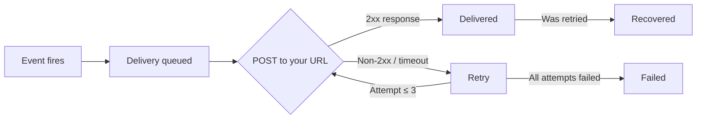

## Delivery lifecycle

Every time a subscribed event fires, DeepSmith creates a delivery for each active webhook that matches the event type. Each delivery follows this lifecycle:



### Delivery statuses

| Status | Description |
|--------|-------------|
| `delivered` | Successfully delivered on the first attempt |
| `recovered` | Failed initially but succeeded on a retry attempt |
| `failed` | All 3 attempts failed |
| `pending` | Delivery is queued or in progress |

## Retry policy

Failed deliveries are retried automatically with exponential backoff:

| Attempt | Delay | Total elapsed |
|---------|-------|---------------|
| 1st | Immediate | 0s |
| 2nd | 10 seconds | ~10s |
| 3rd | 60 seconds | ~70s |

<Info>
  A delivery is considered failed when your endpoint returns a non-2xx HTTP status code, the connection times out (15 second limit), or a connection error occurs.
</Info>

If all 3 attempts fail, the delivery is marked as `failed` and the webhook's `consecutive_failures` counter is incremented.

## Auto-disable

When a webhook accumulates **10 consecutive failures**, it is automatically disabled to protect your endpoint from unnecessary traffic.

When a webhook is auto-disabled:
- Its status changes to `DISABLED`
- No further deliveries are sent
- You can re-enable it from **Settings > Webhooks**, which resets the failure counter

<Tip>
  Monitor the `consecutive_failures` field on your webhooks. If it's climbing, check your endpoint's health before it reaches 10 and gets disabled.
</Tip>

## Viewing delivery history

Open a webhook from **Settings > Webhooks** and navigate to the **Deliveries** tab. You can filter deliveries by event type and status (`delivered`, `failed`, `recovered`).

### Sample delivery log

```json
{
  "code": 1260,
  "messages": "Webhook deliveries retrieved successfully.",
  "data": {
    "data": [
      {
        "id": "a1b2c3d4-e5f6-7890-abcd-ef1234567890",
        "webhook_id": "9f2a3b4c-5d6e-7f8a-9b0c-1d2e3f4a5b6c",
        "event_type": "content.status_updated",
        "payload": {
          "event": "content.status_updated",
          "timestamp": "2026-04-16T10:30:00+00:00",
          "workspace_id": "019d917f-5d2b-71e7-90f4-4b8bd1cfe98b",
          "is_test": false,
          "data": {
            "id": "7d0e1f2a-3b4c-5d6e-7f8a-9b0c1d2e3f4a",
            "title": "10 Strategies for Content Marketing in 2026",
            "status": "PUBLISHED",
            "slug": "content-marketing-strategies-2026"
          }
        },
        "http_status": 200,
        "response_body": "{\"received\":true}",
        "response_time_ms": 185,
        "attempt": 1,
        "max_attempts": 3,
        "delivery_status": "delivered",
        "successful": true,
        "is_test": false,
        "delivered_at": "2026-04-16T10:30:01.000000Z",
        "created_at": "2026-04-16T10:30:00.000000Z"
      },
      {
        "id": "b2c3d4e5-f6a7-8901-bcde-f12345678901",
        "webhook_id": "9f2a3b4c-5d6e-7f8a-9b0c-1d2e3f4a5b6c",
        "event_type": "agent_task.status_updated",
        "payload": {
          "event": "agent_task.status_updated",
          "timestamp": "2026-04-16T09:15:00+00:00",
          "workspace_id": "019d917f-5d2b-71e7-90f4-4b8bd1cfe98b",
          "is_test": false,
          "data": {
            "id": "6c5d4e3f-2a1b-0c9d-8e7f-6a5b4c3d2e1f",
            "name": "Write article: Content Marketing",
            "status": "SUCCEEDED"
          }
        },
        "http_status": 500,
        "response_body": "{\"error\":\"Internal Server Error\"}",
        "response_time_ms": 12500,
        "attempt": 3,
        "max_attempts": 3,
        "delivery_status": "failed",
        "successful": false,
        "is_test": false,
        "delivered_at": "2026-04-16T09:16:10.000000Z",
        "created_at": "2026-04-16T09:15:00.000000Z"
      }
    ],
    "links": {},
    "meta": {
      "current_page": 1,
      "last_page": 5,
      "per_page": 20,
      "total": 93
    }
  }
}
```

### Delivery fields

| Field | Type | Description |
|-------|------|-------------|
| `id` | `uuid` | Delivery ID |
| `webhook_id` | `uuid` | Parent webhook ID |
| `event_type` | `string` | Event type that triggered this delivery |
| `payload` | `object` | Full payload that was sent |
| `http_status` | `integer\|null` | HTTP response status (`null` for connection errors) |
| `response_body` | `string\|null` | Response body (truncated to 2048 chars) |
| `response_time_ms` | `integer\|null` | Response time in milliseconds |
| `attempt` | `integer` | Which attempt this was (1, 2, or 3) |
| `max_attempts` | `integer` | Maximum attempts (always 3) |
| `delivery_status` | `string` | Computed status: `delivered`, `recovered`, `failed`, or `pending` |
| `successful` | `boolean` | Whether the delivery succeeded |
| `is_test` | `boolean` | Whether this was a test delivery |
| `delivered_at` | `datetime` | When the delivery was attempted |
| `created_at` | `datetime` | When the delivery was created |

## Retrying a failed delivery

From the delivery log, click **Retry** on any failed delivery. This re-queues the delivery with the original event type and payload. The new attempt appears as a separate entry in the delivery log.

```json
{
  "code": 1261,
  "messages": "Webhook delivery retried successfully.",
  "data": {
    "id": "b2c3d4e5-f6a7-8901-bcde-f12345678901",
    "webhook_id": "9f2a3b4c-5d6e-7f8a-9b0c-1d2e3f4a5b6c",
    "event_type": "agent_task.status_updated",
    "payload": {
      "event": "agent_task.status_updated",
      "timestamp": "2026-04-16T09:15:00+00:00",
      "workspace_id": "019d917f-5d2b-71e7-90f4-4b8bd1cfe98b",
      "is_test": false,
      "data": {
        "id": "6c5d4e3f-2a1b-0c9d-8e7f-6a5b4c3d2e1f",
        "name": "Write article: Content Marketing",
        "status": "SUCCEEDED"
      }
    },
    "http_status": 500,
    "response_body": "{\"error\":\"Internal Server Error\"}",
    "response_time_ms": 12500,
    "attempt": 3,
    "max_attempts": 3,
    "delivery_status": "failed",
    "successful": false,
    "is_test": false,
    "delivered_at": "2026-04-16T09:16:10.000000Z",
    "created_at": "2026-04-16T09:15:00.000000Z"
  }
}
```

<Note>
  Only failed deliveries can be retried. The retry button is not available for successful deliveries.
</Note>

## Performance stats

The webhook detail page shows performance charts for **Event deliveries** (total vs. failed) and **Response time** (min, avg, max). You can switch between three time periods:

| Period | Bucket size | Description |
|--------|-------------|-------------|
| **Last 24 hours** | Hourly | Good for investigating recent issues |
| **This week** | Daily | Default view for ongoing monitoring |
| **Last 30 days** | Daily | Long-term health overview |

### Sample stats response

```json
{
  "code": 1276,
  "messages": "Webhook stats retrieved successfully.",
  "data": {
    "deliveries": [
      { "date": "2026-04-10", "total": 12, "failed": 1 },
      { "date": "2026-04-11", "total": 15, "failed": 0 },
      { "date": "2026-04-12", "total": 8, "failed": 0 },
      { "date": "2026-04-13", "total": 11, "failed": 2 },
      { "date": "2026-04-14", "total": 14, "failed": 0 },
      { "date": "2026-04-15", "total": 10, "failed": 0 },
      { "date": "2026-04-16", "total": 13, "failed": 1 }
    ],
    "response_times": [
      { "date": "2026-04-10", "min": 85, "avg": 210, "max": 12500 },
      { "date": "2026-04-11", "min": 92, "avg": 180, "max": 340 },
      { "date": "2026-04-12", "min": 78, "avg": 195, "max": 290 },
      { "date": "2026-04-13", "min": 88, "avg": 1200, "max": 15000 },
      { "date": "2026-04-14", "min": 80, "avg": 175, "max": 310 },
      { "date": "2026-04-15", "min": 90, "avg": 200, "max": 350 },
      { "date": "2026-04-16", "min": 82, "avg": 250, "max": 4500 }
    ]
  }
}
```

## Best practices

<AccordionGroup>
  <Accordion title="Respond quickly">
    Return a `200` status code as fast as possible. Process the webhook payload asynchronously (e.g., queue a background job) rather than doing heavy work in the request handler. DeepSmith enforces a **15-second timeout**.
  </Accordion>

  <Accordion title="Handle duplicates">
    Use the `X-Webhook-Delivery` header to deduplicate deliveries. Your endpoint may receive the same event more than once due to retries.
  </Accordion>

  <Accordion title="Monitor your error rate">
    Check the `error_rate` on your webhooks and the performance charts regularly. A rising error rate indicates your endpoint may have issues.
  </Accordion>

  <Accordion title="Use a queue">
    Don't process webhooks synchronously. Push them onto a queue (SQS, Redis, RabbitMQ) and process them asynchronously. This keeps your endpoint responsive and prevents timeouts.
  </Accordion>

  <Accordion title="Log everything">
    Log incoming webhook payloads and your processing results. DeepSmith's delivery history shows what was sent, but your logs capture how your application handled it.
  </Accordion>
</AccordionGroup>
